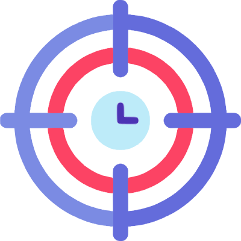

<h1 align="center" id="title"></p>Focus ADM Panel</h1>

A website made in React, TypeScript, Tailwind and shadcn/ui. The website serves as the Admin Panel for the [Focus Website](https://github.com/yuuhLKT/focus-website)

#### Environment Variables

To run this project, you will need to add the following environment variables to your .env file

`VITE_EMAIL_ACCESS=YOUR_EMAIL_PREFERENCE`
`VITE_PASSWORD_ACCESS=YOUR_PASSWORD_PREFERENCE`

<p>1. Clone Repository</p>

```bash
git clone https://github.com/yuuhLKT/focus-adm-panel.git
```

<p>2. Instal dependencies</p>

```bash
npm i
```

<p>3. Start the project</p>

```bash
npm run dev
```

<h2>💻 Built with</h2>

Technologies used in the project:

-   React
-   TypeScript
-   Tailwind
-   shadcn/ui

<h2>🛡️ License:</h2>

This project is licensed under the MIT License
